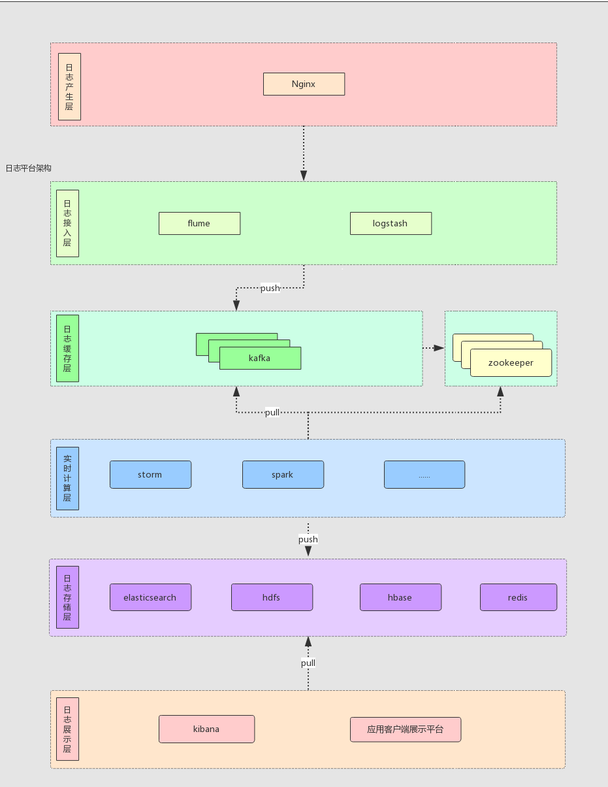
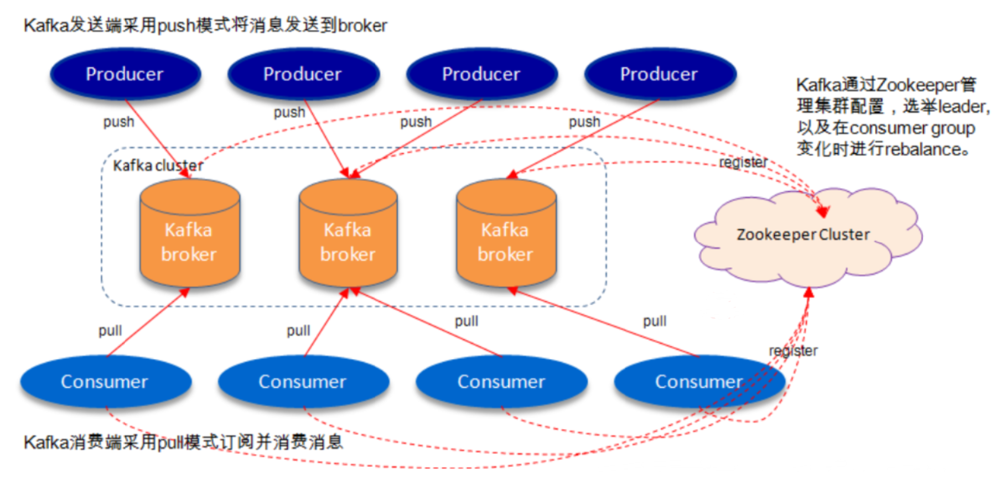
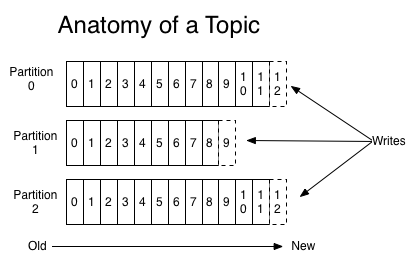
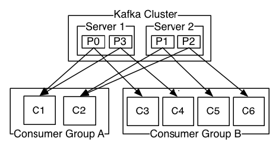

## kafka

Kafka是一个分布式、支持分区的（partition）、多副本的（replica），基于zookeeper协调的分布式消息系统

特性：实时的处理大量数据（比如基于hadoop的批处理系 统、低延迟的实时系统、Storm/Spark流式处理引擎，web/nginx日志、访问日志，消息服务等等），用scala语言编写

**使用场景：**

> - 日志收集：一个公司可以用Kafka收集各种服务的log，通过kafka以统一接口服务的方式开放给各种consumer，例如hadoop、Hbase、Solr等。 
> - 消息系统：解耦和生产者和消费者、缓存消息等。 
> - 用户活动跟踪：Kafka经常被用来记录web用户或者app用户的各种活动，如浏览网页、搜索、点击等活动，这 些活动信息被各个服务器发布到kafka的topic中，然后订阅者通过订阅这些topic来做实时的监控分析，或者装载到 hadoop、数据仓库中做离线分析和挖掘。 
> - 运营指标：Kafka也经常用来记录运营监控数据。包括收集各种分布式应用的数据，生产各种操作的集中反 馈，比如报警和报告。




### 一、kafka基本概念

kafka是一个分布式的，分区的消息(commit log)服务。它提供一个消息系统应该具备的功能，但是确有着独特的设计。可以这样来说，Kafka借鉴了JMS规范的思想，但是确并没有完全遵循JMS规范

#### 1. 消息相关术语

> broker : 消息中间件处理节点，一个Kafka节点就是一个broker，一个或者多个Broker可以组成一个Kafka集群
>
> topic：Kafka根据topic对消息进行归类，发布到集群的每条消息都需要指定一个topic
>
> producer：消息生产者
>
> consumer：消息消费者
>
> consumerGroup：每个consumer属于一个特定的consumerGroup，一个消息可以被多个不同的group消费，但该group中只能有一个consumer可以消费该消息
>
> partition：物理上的概念，一个topic可以分为多个partition，每个partition内部消息是有序的




​                            服务端broker和客户端producer、consumer之间通过TCP协议通信


#### 2. 主题topic和消息日志log

Topic是一个类别的名称，同类消息发送至同一个topic下，每个topic下面可以有多个分区（Partition）日志文件



partition是一个**有序**的message序列，每个partition按照顺序添加到**各自的commit log文件**中，每个partition中消息有一个唯一编号**offset**

- 理解Topic、Partition、Broker

  > 一个topic，代表逻辑上的一个业务数据集，比如按数据库里不同表的数据操作消息区分放入不同topic，订单相关操作消息放入订单topic，用户相关操作消息放入用户topic，对于大型网站来说，后端数据都是海量的，订单消息很可能是非常巨量的，比如有几百个G甚至达到TB级别，如果把这么多数据都放在一台机器上可定会有容量限制问题，那么就可以在topic内部划分多个partition来分片存储数据，不同的partition可以位于不同的机器上，每台机器上都运行一个Kafka的进程Broker。
  >
  > kafka集群，在配置的时间范围内，维护所有的由producer生成的消息，而不管这些消息有没有被消费。例如日志保留(log retention )时间被设置为2天。kafka会维护最近2天生产的所有消息，而2天前的消息会被丢弃。kafka的性能与保留的数据量的大小没有关系，因此保存大量的数据(日志信息)不会有什么影响。
  >
  > 每个consumer是基于自己在commit log中的消费进度(offset)来进行工作的。在kafka中，消费offset由consumer自己来维护；一般情况下我们按照顺序逐条消费commit log中的消息，当然我可以通过指定offset来重复消费某些消息，或者跳过某些消息。
  > 这意味kafka中的consumer对集群的影响是非常小的，添加一个或者减少一个consumer，对于集群或者其他consumer来说，都是没有影响的，因为**每个consumer维护各自的offset**。所以说**kafka集群是无状态的，性能不会因为consumer数量受太多影响**。kafka还将很多**关键信息记录在zookeeper里**，保证自己的无状态，从而在水平扩容时非常方便

- 为什么要对Topic下数据进行分区存储？

  >  1、commit log文件会受到所在机器的文件系统大小的限制，分区之后，理论上一个topic可以处理任意数量的数据。
  >
  > 2、为了提高并行度。

- 分布式Distribution

  > log的partition分布在kafka集群中不同的broker上，每个broker可以请求备份其他broker中partition的数据，kafka集群支持配置一个partition备份的数量
  >
  > 针对每个partition都有一个broker起“**leader**”作用，0或多个其他broker作为“**follwer**”作用
  >
  > **leader**处理所有这个partition的读写请求
  >
  > **follower**被动复制leader的结果
  >
  > 如果leader失效了，其中一个follower自动变成新的leader

#### 3. producer

生产者将消息发送到topic中去，同时负责选择将message发送到topic的哪一个partition中。

通过**round-robin**做简单的负载均衡。也可以根据消息中的某一个关键字来进行区分。通常第二种方式使用的更多。


#### 4. consumer

传统的消息传递模式：队列queue和发布订阅publish-subscribe

- queue模式：多个consumer从服务器中读取数据，消息只会到达一个consumer
- publish-subscribe：消息会被广播给所有的consumer

kafka基于以上两种模式提供了一种抽象的概念：consumer group

- queue模式：所有的consumer都位于同一个consumer group下
- publish-subscribe模式：所有的consumer都有自己唯一的consumer group



通常一个topic会有几个consumer group，每个consumer group都是一个逻辑上的订阅者（ logical
subscriber ）。每个consumer group由多个consumer instance组成，从而达到可扩展和容灾的功能。

即：**将consumer group作为传统的consumer的概念，和其中的consumer由多个组成，可以达到可扩展和容灾的目的**


#### 5. 消费顺序

一个partition中数据的存放是有序的，所以一个partition同一个时刻在一个consumer group中只有一个consumer instance在消费，从而保证顺序。

consumer group中的consumer instance的数量不能比一个Topic中的partition的数量多，否则，多出来的
consumer消费不到消息。

Kafka只在partition的范围内保证消息消费的局部顺序性，不能在同一个topic中的多个partition中保证总的消费顺序性。

如果有在总体上保证消费顺序的需求，那么我们可以通过将topic的partition数量设置为1，将consumer group中的consumer instance数量也设置为1。


发送到一个Topic中的message会按照发送的顺序添加到commit log中。

一个consumer在commit log中可以按照发送顺序来消费message。

如果一个topic的备份因子设置为N，那么Kafka可以容忍N-1个服务器的失败，而存储在commit log中的消息不会丢失。


### 附录一：kafka集群搭建与使用

> kafka使用Scala语音开发，需要安装JDK
>
> kafka依赖zookeeper，所以需要先安装zookeeper

```shell
# 1.准备安装包，解压
cd /usr/local/kafka
wget https://www.apache.org/dyn/closer.cgi?path=/kafka/2.6.1/kafka_2.12-2.6.1.tgz
tar -zxvf kafka_2.12-2.6.0.tgz
cd kafka_2.12-2.6.0

# 2.启动服务  语法：kafka-server-start.sh [-daemon] server.properties
# -daemon 表示是否后台运行  server.properties 配置文件
# 注意：在启动kafka时会使用linux主机名关联的ip地址，所以需要把主机名和linux的ip映射配置到本地host里
bin/kafka‐server‐start.sh ‐daemon config/server.properties
# 进入zookeeper目录通过zookeeper客户端查看下zookeeper的目录树
bin/zkCli.sh
ls / #查看zk的根目录kafka相关节点
ls /brokers/ids #查看kafka节点

# 3.创建主题
bin/kafka-topics.sh --create --zookeeper 101.133.167.247:2181 --replication-factor 1 --partitions 1 --topic test
# 查看主题
bin/kafka-topics.sh --list --zookeeper 101.133.167.247:2181
# 删除主题
bin/kafka-topics.sh --delete --topic test --zookeeper 101.133.167.247:2181

# 4.发送消息 
#kafka自带了一个producer命令客户端，可以从本地文件中读取内容，或者我们也可以以命令行中直接输入内容，并将这些内容以消息的形式发送到kafka集群中。在默认情况下，每一个行会被当做成一个独立的消息。
bin/kafka-console-producer.sh --broker-list 101.133.167.247:9092 --topic test1
>one message
>two message

# 5.消费消息
# kafka同样也携带了一个命令行客户端，会将获取到内容在命令中进行输出，默认是消费最新的消息
bin/kafka-console-consumer.sh --bootstrap-server 101.133.167.247:9092 --consumer-property group.id=test1Group --topic test1
# 消费之前的消息 可以通过--from-beginning参数指定
bin/kafka-console-consumer.sh --bootstrap-server 101.133.167.247:9092 --from-beginning --topic test1

# 其他命令
# 查看组名
bin/kafka‐consumer‐groups.sh ‐‐bootstrap‐server 192.168.0.60:9092 ‐‐list
#查看消费者的消费偏移量
bin/kafka‐consumer‐groups.sh ‐‐bootstrap‐server 192.168.0.60:9092 ‐‐describe ‐‐group testGroup
# 消费多主题
bin/kafka‐console‐consumer.sh ‐‐bootstrap‐server 192.168.0.60:9092 ‐‐whitelist "test|test‐2"
# 单播消费
# 一条消息只能被某一个消费者消费的模式，类似queue模式，只需让所有消费者在同一个消费组里即可
bin/kafka‐console‐consumer.sh ‐‐bootstrap‐server 192.168.0.60:9092 ‐‐consumer‐property group.id=testGroup ‐‐topic test
bin/kafka‐console‐consumer.sh ‐‐bootstrap‐server 192.168.0.60:9092 ‐‐consumer‐property group.id=testGroup ‐‐topic test
# 多播消费
# 一条消息能被多个消费者消费的模式，类似publish-subscribe模式费，针对Kafka同一条消息只能被同一个消费组下的某一个消费者消费的特性，要实现多播只要保证这些消费者属于不同的消费组即可。我们再增加一个消费者，该消费者属于testGroup-2消费组，结果两个客户端都能收到消息
bin/kafka‐console‐consumer.sh ‐‐bootstrap‐server 192.168.0.60:9092 ‐‐consumer‐property group.id=testGroup‐1 ‐‐topic
bin/kafka‐console‐consumer.sh ‐‐bootstrap‐server 192.168.0.60:9092 ‐‐consumer‐property group.id=testGroup‐2 ‐‐topic
```

### 附录二：kafka集群配置

```shell
# 1.建立好其他2个broker的配置文件
cp server.properties server-1.properties
cp server.properties server-2.properties

# 更改配置文件内容
server-1.properties
#broker.id属性在kafka集群中必须要是唯一 
broker.id=1 
#kafka部署的机器ip和提供服务的端口号 
listeners=PLAINTEXT://192.168.0.60:9093 
log.dir=/usr/local/data/kafka‐logs‐1

server-2.properties
#broker.id属性在kafka集群中必须要是唯一 
broker.id=2
#kafka部署的机器ip和提供服务的端口号 
listeners=PLAINTEXT://192.168.0.60:9094
log.dir=/usr/local/data/kafka‐logs‐2


```


server.properties核心配置详解：

broker.id：（0）每个broker都可以用一个唯一的非负整数id进行标识；这个id可以作为broker的名唯一的即可

log.dirs ：（/tmp/kafka-logs）kafka存放数据的路径。这个路径并不是唯一的，可以是多个，路径之间只需要使用逗含最少partitions的路径下进行。

listeners：（9092）server接受客户端连接的端口

zookeeper.connect：（localhost:2181）zooKeeper连接字符串的格式为：hostname:port，此处hostname和port分别是Zo如果是集群，连接方式为 hostname1:port1, hostname2:port2, hostname3:port3

log.retention.hours：（168）每个日志文件删除之前保存的时间。默认数据保存时间对所有topic都一样。

min.insync.replicas：（1）当producer设置acks为-1时，min.insync.replicas指定replicas的最小数目（必须确没有达到，producer发送消息会产生异常

delete.topic.enable：（false）是否允许删除主题

